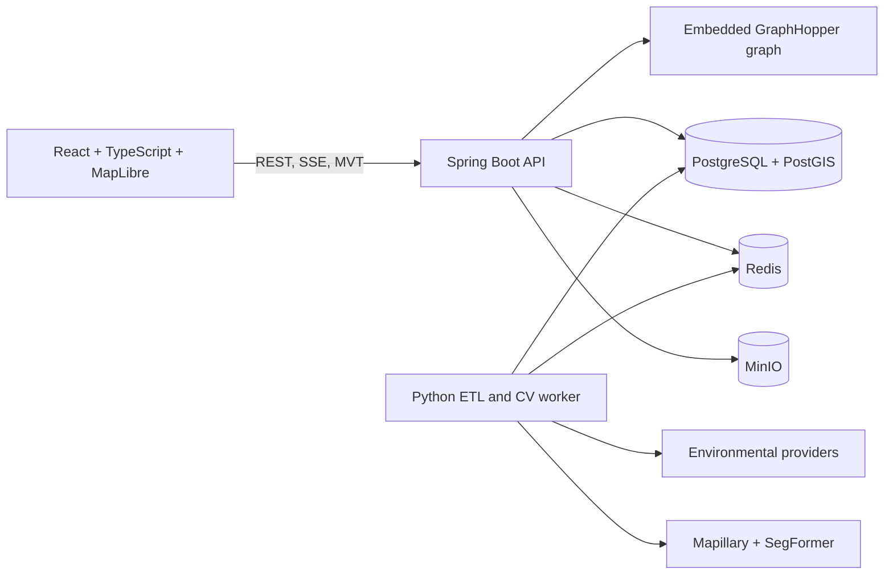

# Beacon

Health-aware walking and cycling navigation for New York City. Beacon compares
routes on distance and duration against relative exposure to air pollution,
pollen, traffic, construction, industrial sites, grade, heat, crowding, and
shade, then shows the trade-off rather than choosing for you.

**Not medical advice.** Every comparison is relative. See
[what the imagery scores do and do not claim](#what-the-imagery-scores-do-and-do-not-claim).

## What it does

An asthma-weighted profile routed through NoMad, measured on the imported graph:

| Variant | Distance | PM2.5 exposure percentile |
| --- | ---: | ---: |
| fastest | 1,066 m | 93.8 |
| cleanest | 1,347 m | 75.4 |

Across three corridor trips: **mean 21% lower integrated PM2.5 exposure for a
19% distance penalty**. Both figures come from `POST /api/v1/routes/compare`
against the live graph rather than from a model of one.

## The one decision everything hangs on

The data sources refresh at wildly different rates, and GraphHopper fixes edge
weights at import time. Anything that changes hourly cannot be an encoded
value. Beacon splits into three clocks:

| Clock | Cadence | Sources | How it reaches the router |
| --- | --- | --- | --- |
| Static | Monthly | OSM network, NYCCAS pollution surfaces, street trees, elevation, EPA facilities, road-class traffic proxy | Quantised into 7-bit encoded values, baked in at import |
| Slow | Nightly / weekly | DOB construction permits, Mapillary imagery and its CV scores | Stored in PostGIS, folded into the next import |
| Fast | 15 min - 1 hr | OpenAQ, AirNow, NWS, Google Pollen | Contoured into a capped polygon set, passed per request as custom-model areas |

Contraction hierarchies stay enabled, because the fast layer arrives through
`in_area` priority rules rather than as per-edge weights.

### Sparse monitors, decomposed

NYC has roughly a dozen regulatory PM2.5 monitors. Interpolating them across
800 square kilometres produces smooth nonsense that would route people onto a
highway shoulder. Beacon separates space from time instead:

```
exposure(segment, hazard, t)
    = spatial_prior(segment, hazard)   # NYCCAS land-use regression, 300 m
    x temporal_scalar(hazard, t)       # citywide mean now / annual mean
    + local_offset(segment, hazard, t) # construction, alerts, downwind plume
```

The land-use regression already knows Midtown carries more traffic PM2.5 than
Riverdale. The live monitors say whether today is a 0.6x day or a 3.5x
wildfire-smoke day. Every hazard is percentile-ranked 0-100 across segments
before it reaches the cost function, so a weight means the same thing whether
it is applied to micrograms or to a pollen index.

## Architecture



Three processes, one database. The API owns authentication, routing,
persistence, and speech. Python owns anything that touches a raster, a model
checkpoint, or a provider client. They never call each other synchronously:
Python writes to Postgres and Java reads from it.

## Scale of the working system

| | |
| --- | ---: |
| Routable segments | 580,211 |
| Source OSM ways | 394,368 |
| Graph nodes / edges | 823,561 / 1,132,194 |
| Edges with a non-zero static score | 1,074,499 |
| Street trees loaded | 652,173 |
| EPA industrial facilities | 7,118 |
| Mapillary images harvested and scored | 12,198 |
| Segments with CV-derived scores | 841 |
| Live environmental readings stored | 2,022 |
| Tests | 87 Java, 85 Python |

## Health data, deliberately not stored

Self-reported sensitivities are the most personal thing this product touches,
so the server never keeps them. Trigger weights are sent with each request and
discarded; the `trigger_profile` table was removed rather than left as an
invitation to start storing them. Accounts exist so that saved routes can
belong to someone: a route is readable only by its owner, a stranger's request
is answered as not-found rather than forbidden, and deleting an account
cascades to its routes and their feedback.

## Sky view factor, and why it is the strongest CV feature

A low sky view factor means the street is walled in, and walled-in streets hold
exhaust near the pavement instead of letting it disperse. That is a real
atmospheric-dispersion effect rather than a proxy for one. Sky pixels are
weighted by vertical position, so a strip of sky at the horizon does not read
like open sky overhead, and the result acts as an amplifier on particulate
exposure rather than as a hazard of its own.

Segments with no imagery carry an explicit no-data sentinel rather than zero.
Without it, all 393,674 unphotographed OSM ways would rank as the worst canyon
in the city and the feature would make routing worse instead of better.

## What the imagery scores do and do not claim

The computer-vision scores are the least generalisable data in the project, so
their limits are worth stating plainly.

**Coverage is one corridor, not a city.** Mapillary harvesting is scoped to
NoMad/Midtown South: 12,198 images snapped to 944 of 580,211 routable segments.
Every other segment carries an explicit no-data sentinel rather than a zero, so
routing rules skip it instead of treating an unphotographed street as the worst
case.

**Percentiles rank against photographed segments only.** A 95th-percentile sky
view factor means most open of the harvested corridor, not of New York.
Comparisons between neighbourhoods are not supported by this data. The
aggregation job prints its coverage on every run so the denominator stays
visible.

**Sky view factor needs daylight.** After dark the model reads unlit sky as
structure, which collapses the measurement: night frames on these streets
average 0.006 against 0.086 for daylight frames. Aggregation uses frames
captured between 08:00 and 17:00 local time. Night frames are still scored and
kept for the route viewer.

**Vehicle and person counts are a coarse proxy.** Semantic segmentation labels
pixels, not objects, so vehicles that touch in frame merge into one component
and dense traffic undercounts. The pixel fractions, not the counts, drive the
crowd prior. Frames whose lower fifth is mostly vehicle are treated as dashcam
shots of the camera car's own dashboard and excluded from the crowd prior.

**Construction is not detected from imagery.** Cityscapes has no construction
class, and inferring it from unrelated classes such as fences or walls would be
fabricated. DOB permit data remains the source of truth.

## Local development

Prerequisites: Java 21, Python 3.12, `uv`, and Docker Desktop.

```bash
make up
make osm
make api
make pipeline
make web
```

`make osm` downloads roughly 500 MB of source map data and creates the smaller
five-borough extract at `data/osm/nyc.osm.pbf`. Docker is used for Osmium when
the command is not installed locally.

The API uses the root environment variables when present and otherwise connects
to the local Beacon PostGIS database defined in `docker-compose.yml`. Once the
stack and API are running, the health check is available at
`http://localhost:8080/actuator/health`, and the web app is available at
`http://localhost:5173`.

## Static score build

After the segment and elevation jobs documented in `pipeline/README.md`, run
the current static scoring jobs from `pipeline/`:

```bash
uv run beacon-pipeline refresh-nyccas-scores --raster-dir ../data/nyccas
uv run beacon-pipeline refresh-street-tree-scores
uv run beacon-pipeline refresh-industrial-scores --epa-data-dir ../data/epa
uv run beacon-pipeline refresh-traffic-scores --osm-path ../data/osm/nyc.osm.pbf
```

The industrial job downloads public EPA TRI and ECHO data. The traffic job
uses motorway, trunk, primary, and secondary OSM roads with class-weighted
distance decay. Both jobs preserve their raw proximity measurements and write
comparable percentile ranks to `segment_static_score`.

Static scores are written during GraphHopper import, so refreshed scores need a
new graph. Removing `graph-cache/` and restarting forces one; the blue-green
rebuild described under [Operations](#operations) does the same without
downtime. Startup logs report the indexed OSM way count and how many graph edges
carry a non-zero score.

Run the backend and pipeline test suites with:

```bash
cd api && ./gradlew test
cd ../pipeline && uv run --with pytest pytest
```

With Docker services and the API running, exercise the clear-day/smoke-day
checkpoint and routing benchmark with:

```powershell
.\scripts\smoke-day-demo.ps1
```

The script temporarily seeds clean and wildfire PM2.5 readings plus 20 hazard
areas, verifies a measurable route shift, reports median and p95 latency, and
then restores the prior live snapshots.

## Route API

`POST /api/v1/routes` accepts origin and destination arrays in
`[latitude, longitude]` order. GeoJSON coordinates in the response follow the
standard `[longitude, latitude]` order.

```bash
curl -X POST http://localhost:8080/api/v1/routes \
  -H "Content-Type: application/json" \
  -d '{
    "origin": [40.7484, -73.9857],
    "destination": [40.7359, -73.9911],
    "mode": "foot"
  }'
```

Supported modes are `foot` and `bike`; common aliases such as `walk` and
`cycling` are also accepted. The response contains a GeoJSON LineString,
`distance_m`, `duration_s`, and GraphHopper instruction details.

## Profile-aware route comparison

`POST /api/v1/routes/compare` accepts the active trigger profile and returns
`fastest`, `balanced`, and `cleanest` routes. Each variant includes a route UUID,
an exposure breakdown, comparative deltas against the fastest route, and detour
cap metadata.

```bash
curl -X POST http://localhost:8080/api/v1/routes/compare \
  -H "Content-Type: application/json" \
  -d '{
    "origin": [40.7484, -73.9857],
    "destination": [40.7359, -73.9911],
    "mode": "foot",
    "preset": "asthma",
    "weights": {},
    "hard_avoids": [],
    "max_grade_pct": 20,
    "detour_tolerance": 0.25,
    "conservatism": 1.0
  }'
```

The onboarding preview uses `POST /api/v1/profiles/preview` with the same
contract. Preview routes are intentionally not stored.

Submit post-route feedback using a route UUID returned by the comparison:

```bash
curl -X POST http://localhost:8080/api/v1/routes/<route-id>/feedback \
  -H "Content-Type: application/json" \
  -d '{"feltWorse": true, "whichSegments": [3]}'
```

## Street imagery analysis

`POST /api/v1/routes/{id}/analysis` samples the route every 50 m in PostGIS and
picks the nearest image whose compass angle sits within 45 degrees of the route
bearing, so a camera pointing across the street is not mistaken for a view of
the street being walked. It returns `202` with an analysis id and queues
anything unscored.

`GET /api/v1/analysis/{id}/stream` emits each frame over Server-Sent Events as
it becomes available, so the viewer fills progressively. Frames already scored
offline arrive on the first pass, which is the common case. A stalled worker
ends the stream with partial results rather than an error.

## Spoken guidance

`GET /api/v1/routes/{id}/audio` returns every line for a route with a clip URL
per line. Synthesis happens at route-build time, never mid-turn, and the client
preloads all clips before the walk starts.

Speech is cached in object storage under a hash of the normalised line plus
voice and speed. Turn instructions repeat enormously across routes, so the
second route that says "turn left onto Broadway" costs nothing. Fish Audio is
the hosted voice and Piper is the local fallback; with neither configured the
manifest still returns text and the browser's own voice reads it.

Announcement copy describes the street and never the listener. A test asserts
that no line mentions a condition, a symptom, medication, or an absolute
concentration, because the underlying surfaces support relative comparison only.

## Data sources

| Provider | Data | Licence |
| --- | --- | --- |
| OpenStreetMap contributors | Street network and road classes | ODbL |
| Mapillary contributors | Street-level imagery | CC BY-SA |
| NYC DOHMH (NYCCAS) | Air pollution surfaces | NYC Open Data |
| NYC Parks | 2015 Street Tree Census | NYC Open Data |
| NYC DOB | Construction permits | NYC Open Data |
| US EPA | TRI and ECHO facilities | Public domain |
| NOAA / National Weather Service | Forecasts and alerts | Public domain |
| OpenAQ | Air quality observations | CC BY 4.0 |
| AirNow (EPA/NOAA) | Official AQI category | Public domain |
| Google Pollen API | Daily pollen indices | Maps Platform terms |
| USGS 3DEP | Elevation and grade | Public domain |
| OpenFreeMap / OpenMapTiles | Basemap tiles | ODbL |
| NVIDIA SegFormer (Cityscapes) | Segmentation model | NVIDIA source-code licence |

The same table is shown inside the app, since several of these licences require
attribution where the data is used.

## Operations

Every request carries an `X-Request-Id`, echoed in the response, present in log
lines, and attached to work handed to the Python worker, so an async pipeline
can be followed end to end. Custom metrics behind `/actuator/metrics` cover
routing latency p50 and p95, live hazard polygon count, speech cache hit rate,
images scored, and graph edge count.

Routing, audio, and analysis are rate limited per caller, keyed on the account
when there is one and the client address otherwise. Analysis is capped hardest
because it can queue image inference.

The graph can be rebuilt and swapped in without downtime. A new graph is
imported into a sibling directory and published atomically; the retired
instance closes only after in-flight requests drain, and a failed import leaves
the running graph untouched.

## Deployment

Vercel hosts the web app; the API needs a host that can run a JVM with roughly
2 GB for the graph, plus PostGIS and Redis. Deploy the API first and confirm
`/actuator/health`, because the web app is useless without it.

The API must be reachable at the same origin as the web app, or be told to
allow the web app's origin. Pick one:

**Same-origin proxy (preferred).** Edit the placeholder host in
`web/vercel.json` and leave `VITE_API_BASE_URL` unset. Browser requests go to
`/api/...` on the Vercel domain and are rewritten to the API, so CORS never
applies and credentials stay first-party.

**Direct cross-origin.** Set `VITE_API_BASE_URL` to the API's URL at build time
and set `BEACON_CORS_ALLOWED_ORIGINS` on the API to the web app's origin.
Origins must be listed explicitly; a wildcard is refused because authentication
sends credentials.

`VITE_*` variables are inlined into the client bundle, so never put a provider
key in one. All provider keys belong to the API and the pipeline.

### Storage is the binding constraint

The local database is about 848 MB, of which roughly 330 MB is pipeline staging
data that nothing reads at request time: the street tree census, the per-source
sample tables, and the traffic road table. `scripts/export-runtime-data.sh`
dumps everything except those, which brings the restore to roughly 518 MB.

That still exceeds the free tier on Neon and Supabase, both 500 MB. Railway is
the easier fit because its storage is usage-based rather than capped, and the
API, Postgres, and Redis can sit in one project on a private network. Fly works
too, with a Postgres app and a large enough volume. The remaining option is to
trim the segment table to a bounding box smaller than the five boroughs and
accept that routing only works inside it.

Either host injects its own `PORT`, which `application.yml` reads and the
container health check follows.

### API container

`Dockerfile` builds from the repository root, because the image bakes in
`data/osm/nyc.osm.pbf` so the container can build its own graph without
reaching out to Geofabrik. The graph is written to `/data/graph-cache`, which
`fly.toml` mounts as a volume: first boot imports 1.1M edges in about 40
seconds and later boots load the cache instead.

The import needs more than 1 GB, so `fly.toml` asks for a 2 GB machine, which
is not free. `auto_stop_machines` is off deliberately: a cold start would pay
the graph load in front of a user's request.

The Python pipeline can stay on a local machine. Precomputed scores already live
in the database, so a deployed API routes correctly without it; only refreshes
need the pipeline.

## Known limits

- Imagery covers one corridor: 841 of 580,211 segments. Percentile ranks compare
  photographed segments to each other, not to the city.
- Construction is permit-derived. Cityscapes has no construction class, and
  inferring one from fences or walls would be fabricated.
- Speech falls back to the browser voice unless a Fish Audio account has TTS
  credit or Piper is installed locally.
- The analysis queue is written but has no consumer; offline scoring reads from
  Postgres instead.
- A POST analysis request takes about 30 s against the full graph. The sampler's
  lateral join over 580k segments needs an index pass.
- No browser or end-to-end UI tests.
- MinIO is pinned to `latest` in Compose and should be pinned before deployment.
- Dashcam frames are excluded from the crowd prior, but their dashboards still
  inflate vehicle pixel fractions in per-frame readouts.

## Licence

MIT. See [LICENSE](LICENSE).
