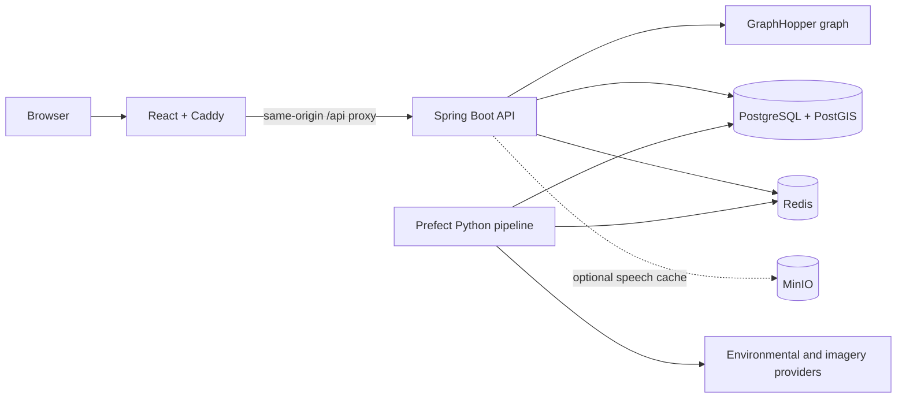

# Beacon Implementation Progress

Last updated: August 22, 2026

Roadmap source: `implementation-steps.md`

Repository baseline: commit `9ff1c89`

## Current status

All application work in roadmap steps 1-117 is represented in the repository.
The remaining work is operational: complete the Railway rollout, restore the
production data, configure provider credentials, and record the final demo.

| Phase | Steps | Status | Outcome |
| --- | ---: | --- | --- |
| Environment and scaffolding | 1-11 | Complete | Java, Python, React, PostGIS, Redis, MinIO, Docker Compose, and developer commands. |
| Graph and baseline routing | 12-24 | Complete | Five-borough OSM graph, walk/bike routing, PostGIS segments, elevation, and map UI. |
| Static hazard layer | 25-44 | Complete | Pollution, tree, pollen, industrial, traffic, grade, MVT tiles, and GraphHopper scores. |
| Trigger profiles | 45-61 | Complete | Fifteen hazards, presets, hard avoids, three route variants, onboarding, and feedback. |
| Live environmental layer | 62-79 | Complete | Provider ingestion, Redis-backed hazard fields, live routing, conditions UI, and smoke-day tests. |
| Computer vision | 80-99 | Complete | Mapillary ingestion, SegFormer scoring, segment aggregation, route analysis, SSE, and filmstrip UI. |
| Voice | 100-106 | Complete | Fish Audio/Piper providers, MinIO cache, route announcements, API, and playback UI. |
| Hardening and deployment | 107-117 | Complete in source | Privacy, deletion, graph swapping, rate limits, telemetry, attribution, deployment containers, and docs. Railway rollout is in progress. |

## Architecture

## Implemented product capabilities

- Walking and cycling route generation over a five-borough GraphHopper graph.
- Fastest, balanced, and cleanest route comparison with detour limits.
- Personal trigger profiles, health-related hard avoids, onboarding previews,
  route history, and feedback.
- Static exposure scoring for pollution, pollen sources, shade, traffic,
  industry, construction, grade, sky view, and crowding.
- Live air-quality, weather, pollen, construction, and alert conditions.
- MapLibre route rendering, hazard vector tiles, exposure breakdowns, and data
  attribution.
- Mapillary/SegFormer route imagery analysis with progressive SSE updates and a
  synced filmstrip.
- Health-aware audio announcements using Fish Audio or Piper with browser voice
  fallback and optional MinIO caching.
- Account registration, HTTP Basic authentication, self-service deletion, a
  medical disclaimer, rate limiting, request IDs, metrics, and blue-green graph
  replacement.

## Application APIs

| Method and path | Purpose |
| --- | --- |
| `GET /actuator/health` | Deployment health check. |
| `POST /api/v1/auth/register` | Create an account. |
| `GET/DELETE /api/v1/auth/me` | Read or delete the authenticated account. |
| `POST /api/v1/routes` | Create a route. |
| `POST /api/v1/routes/compare` | Compare fastest, balanced, and cleanest variants. |
| `POST /api/v1/profiles/preview` | Preview a profile during onboarding. |
| `POST /api/v1/routes/{routeId}/feedback` | Store route and instruction feedback. |
| `GET /api/v1/conditions/now` | Read current environmental conditions. |
| `GET /api/v1/tiles/hazard/{hazard}/{z}/{x}/{y}.mvt` | Render hazard vector tiles. |
| `POST /api/v1/routes/{routeId}/analysis` | Start route imagery analysis. |
| `GET /api/v1/analysis/{analysisId}` | Read analysis state. |
| `GET /api/v1/analysis/{analysisId}/stream` | Stream progressive analysis frames. |
| `GET /api/v1/routes/{routeId}/audio` | Generate or retrieve route audio. |

## Stack and dependencies

| Layer | Main libraries and frameworks |
| --- | --- |
| API | Java 21, Spring Boot 4, Spring MVC, Security, Data JPA, Data Redis, Validation, Actuator, Flyway, Gradle |
| Routing and geometry | GraphHopper 11, JTS, Hibernate Spatial, PostGIS |
| Pipeline | Python 3.12, uv, Prefect 3, GeoPandas, Rasterio, Shapely, Pandas, NumPy, Psycopg, SQLAlchemy, HTTPX |
| Computer vision | PyTorch, TorchVision, Hugging Face Transformers, NVIDIA SegFormer, Pillow |
| Web | React 19, TypeScript, Vite 8, Tailwind CSS 4, MapLibre GL, TanStack Query, Zustand, Lucide, Manrope |
| Data and cache | PostgreSQL 16, PostGIS 3.4, Redis 7, optional MinIO |
| Deployment | Docker, Caddy, Railway config as code, GitHub deployments |

## External APIs and datasets

| Provider | Use |
| --- | --- |
| OpenStreetMap / Geofabrik | Street and path graph, road classes. |
| NYC Open Data / NYC DOHMH | Boroughs, NYCCAS, trees, permits, and building centroids. |
| USGS 3DEP | Segment elevation and grade. |
| EPA TRI and ECHO | Industrial exposure. |
| OpenAQ and AirNow | Current pollutant observations and AQI cross-checks. |
| NOAA/NWS | Forecasts, humidity, wind, and alerts. |
| Google Pollen API | Daily pollen conditions. |
| Mapillary | Geotagged street imagery. |
| Hugging Face / NVIDIA | SegFormer model checkpoint. |
| OpenFreeMap | Web basemap. |
| Fish Audio | Optional generated route speech. |

Provider API keys remain server-side environment variables. No secret belongs
in a `VITE_*` variable or in source control.

## Verification

- The Java test suite passes in an isolated build directory.
- All 85 Python pipeline tests pass.
- Frontend Oxlint and the TypeScript/Vite production build pass.
- The API and web production Docker images build locally.
- The production Caddy proxy returns HTTP 200 for health, SPA fallback, and a
  proxied API request.
- A fresh graph import loads 823,570 nodes and 1,132,204 edges; a restart loads
  the graph from the persistent `/data` volume.

## Remaining operational work

1. Provision the Railway PostGIS and Redis services.
2. Restore `beacon-runtime.dump` into Railway PostGIS.
3. Deploy `beacon-api` with a 2 GB memory allocation and `/data` volume.
4. Deploy the public `beacon-web` service and configure its private API proxy.
5. Add and seal any production provider credentials.
6. Run the production smoke test and enable database backups.

The exact service layout and variables are in
[`docs/railway-deployment.md`](docs/railway-deployment.md).
